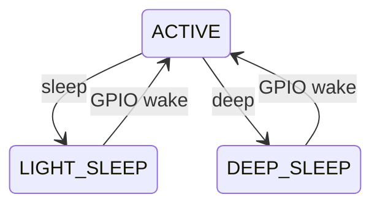

## Overview

This project implements a Linux I2C driver with runtime power management (PM)
support and evaluates its behavior using a physical hardware setup.

A Raspberry Pi acts as the host system, while an ESP32-C6 operates as an I2C
sensor device capable of entering different power states. The driver exposes
a character device interface to userspace, allowing workload generation and
power-state experiments.

The project focuses on analyzing how different userspace workloads influence
power-state transitions and wakeup latency under a fixed sleep policy.

### System Architecture
I2C driver provides a char device interface for the user space usage.
The I2C driver communicate with ESP32 sensor, sending command or request data. 
```
+-----------+      +-------------------------------+      +--------------+
|    User   | <--> |           I2C Driver          | <--> | ESP32 Sensor |
+-----------+      |                               |      +--------------+
                   |  +-------------------------+  |
                   |  |  Char Device Interface  |  |
                   |  |     (/dev/mydevice)     |  |
                   |  +-------------------------+  |
                   |                               |
                   |  +-------------------------+  |
                   |  |        Driver Core      |  |
                   |  |   buffer / PM / I2C     |  |
                   |  +-------------------------+  |
                   +-------------------------------+
```

### Physical Architecture
The following GPIO and I2C connections are used between the Raspberry Pi and ESP32.
```
+------------------+                 +------------------+
|   Raspberry Pi   |                 |      ESP32       |
|                  |                 |                  |
| SDA  (I2C)       |<--------------->| SDA              |
| SCL  (I2C)       |<--------------->| SCL              |
|                  |                 |                  |
| GPIO17           |---------------->| GPIO0  (Wakeup)  |
|                  |                 |                  |
| GPIO26           |<----------------| GPIO4  (IRQ)     |
+------------------+                 +------------------+
```

### I2C Protocol
A simple command-based protocol is used for runtime power management
experiments and ESP32 power state transitions.

| Command | Purpose | Response |
|--------|--------|---------|
| `0x01` | Request sensor data and return the current sensor power state. Used for delay / latency measurement. | 1 byte state |
| `0x02` | Request the sensor to enter **light sleep** mode. | ACK |
| `0x03` | Request the sensor to enter **deep sleep** mode. | ACK |

### Power States
Power states of ESP32 Sensor:
| State | Description |
|------|-------------|
| `P_STATE_ACTIVE` | Sensor is active and processing requests |
| `P_STATE_LIGHT_SLEEP` | Low-power state with fast wakeup |
| `P_STATE_DEEP_SLEEP` | Ultra-low power state requiring full wakeup |

State transition diagram:


### Experiment Design: Impact of User Load under a Fixed Sleep Policy

#### Goal
Evaluate how different userspace load levels affect ESP32 sensor power-state
distribution and wakeup latency **under a fixed sleep periodic policy**.

#### Fixed Sleep Policy (Controlled Variable)
The sleep policy is fixed during a run:

- Light sleep delay: `<T_light>`
- Deep sleep delay: `<T_deep>`

(Example: `T_light = 200 ms`, `T_deep = 10 s`)

#### User Load (Independent Variable)
Userspace simulates different load levels by changing the average access interval
to `/dev/mydevice` (e.g., repeated `read()`):

| Load Level | Average Access Interval |
|-----------|--------------------------|
| Heavy     | 100 ms |
| Moderate  | 1 s |
| Light     | 10 s |

#### Method
1. Fix `(T_light, T_deep)` for the entire run.
2. Run workload generator for a fixed duration (e.g., 5–10 minutes) per load level.
3. Record power-state transitions and timing data.
4. Repeat each load level multiple times to reduce variance.

#### Metrics (Dependent Variables)
- **State residency ratio**: percentage of time in `ACTIVE`, `LIGHT_SLEEP`, `DEEP_SLEEP`
- **Transition counts**: number of entries/exits per state
- **Wakeup latency**: time from GPIO wakeup assertion to first valid response
- **Response delay**: time from userspace request to data returned (end-to-end)

#### Expected Observation (Hypothesis)
- Heavy load keeps the sensor mostly in `ACTIVE` (few sleep entries).
- Moderate load increases `LIGHT_SLEEP` residency.
- Light load increases `DEEP_SLEEP` residency but may increase average response latency.
